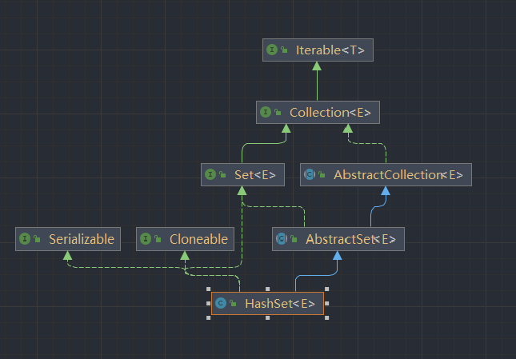
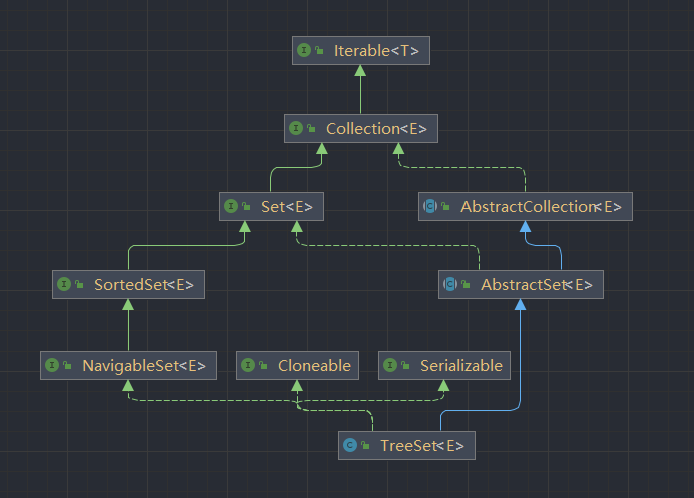
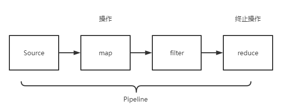

# Five rules of interviewing

1. The essence of the interview is to find similar. We want the interviewer to resonate with us.
2. Problem can be converted between.
3. Problem can be dismantled.
4. Don‘t be led away by interviewer
5. Give thoughtful answers

# Java Collections


The Collection of Java are data structures that can store objects.
And The Collection is an interface, and it extends Iterable interface.

problem: implement a random sequence

```java
public class RandomStringGenerator<T> implements Iterable<T> {

    private final List<T> list;

    public RandomStringGenerator(List<T> list) {
        this.list = list;
    }

    @Override
    public Iterator<T> iterator() {
        return new Iterator<T>() {
            @Override
            public boolean hasNext() {
                return !list.isEmpty();
            }

            @Override
            public T next() {
                return list.get((int) (list.size() * Math.random()));
            }

        };
    }

    public static void main(String[] args) {
        var list = List.of("Python", "Java", "C", "Golang");
        var gen = new RandomStringGenerator<>(list);

        var it = gen.iterator();

        for (int i = 0; i < 100; i++) {
            System.out.println(it.next());
        }
    }
}
```

The source code of Collection.

```java
public interface Collection<E> extends Iterable<E> {
    int size();

    boolean isEmpty();

    boolean contains(Object o);

    Iterator<E> iterator();

    Object[] toArray();

    <T> T[] toArray(T[] a);

    default <T> T[] toArray(IntFunction<T[]> generator) {
        return toArray(generator.apply(0));
    }
}
```

## Set

The Set extends Collection, But the element in set is cannot be repeated.

HashSet is unordered，But TreeSet is ordered.



Because TreeSet is OrderSet, so you can insert a value x, and use the function
lower(x) to find the predecessor of x, and use the function higher(x) to find
the successor of x.

If you have no requirements on the order, and just want to know if an element
is in the set. You should prioritize the HashSet, HashSet to determine
whether an element is in the set only takes O(1).

And, TreeSet Cannot insert null, Because the element of TreeSet must
be comparable. But HashSet can insert null.

## Map

Map: Correspondence between two sets.

Map is a data structure of Java, you input a key to the map, and map will return a
value for you.

HashTable vs HashMap：HashTable is thread safe. And HashTable extends Dictionary, so it
is cannot put null key or null value.

LinkedHashMap: It forms a linked list by time when elements are inserted.

problem: implement a LRUCache.(Least Recently Used)

```java
public class LRUCache<K, V> implements Iterable<K> {

    private final int cacheSize;

    LinkedHashMap<K, V> cache = new LinkedHashMap<>();

    public LRUCache(int cacheSize) {
        this.cacheSize = cacheSize;
    }

    public void cache(K key, V value) {
        if (cache.containsKey(key)) {
            cache.remove(key);
        } else if (cache.size() >= cacheSize) {
            var it = cache.keySet().iterator();
            // remove the first element
            var first = it.next();
            cache.remove(first);
        }

        cache.put(key, value);
    }

    @Override
    public Iterator<K> iterator() {

        var it = cache.entrySet().iterator();

        return new Iterator<>() {
            @Override
            public boolean hasNext() {
                return it.hasNext();
            }

            @Override
            public K next() {
                return it.next().getKey();
            }
        };
    }

    public static void main(String[] args) {
        var lru = new LRUCache<String, Integer>(3);
        lru.cache("A", 1);
        lru.cache("B", 2);
        lru.cache("C", 3);
        lru.cache("D", 4);

        lru.cache("C", 10);

        System.out.println(
                "leave <-" +
                        StreamSupport.stream(lru.spliterator(), false)
                                .collect(Collectors.joining("<-"))
        );
    }
}
```

Summarize：

1. Map is mapping.
2. HashMap is a Map which implemented with a hash table.
3. TreeSet is a Set which implemented with a tree.

# Stream<T>
Stream is not cache, but sequence of data produced over time. And Stream provide sequential, 
parallel computation for a sequence.

1. functional programming
2. pipeline calculation
3. parallel
4. lots of operations



1. immutable/pure
2. lazy
3. safty-monad架构

