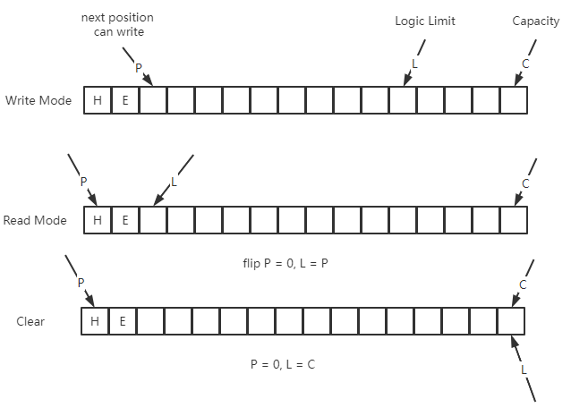

# Five rules of interviewing

1. The essence of the interview is to find similar. We want the interviewer to resonate with us.
2. Problem can be converted between.
3. Problem can be dismantled.
4. Don‘t be led away by interviewer
5. Give thoughtful answers

# Java Basics
## Java Collections


The Collection of Java are data structures that can store objects.
And The Collection is an interface, and it extends Iterable interface.

problem: implement a random sequence

```java
public class RandomStringGenerator<T> implements Iterable<T> {

    private final List<T> list;

    public RandomStringGenerator(List<T> list) {
        this.list = list;
    }

    @Override
    public Iterator<T> iterator() {
        return new Iterator<T>() {
            @Override
            public boolean hasNext() {
                return !list.isEmpty();
            }

            @Override
            public T next() {
                return list.get((int) (list.size() * Math.random()));
            }

        };
    }

    public static void main(String[] args) {
        var list = List.of("Python", "Java", "C", "Golang");
        var gen = new RandomStringGenerator<>(list);

        var it = gen.iterator();

        for (int i = 0; i < 100; i++) {
            System.out.println(it.next());
        }
    }
}
```

The source code of Collection.

```java
public interface Collection<E> extends Iterable<E> {
    int size();

    boolean isEmpty();

    boolean contains(Object o);

    Iterator<E> iterator();

    Object[] toArray();

    <T> T[] toArray(T[] a);

    default <T> T[] toArray(IntFunction<T[]> generator) {
        return toArray(generator.apply(0));
    }
}
```

### Set

The Set extends Collection, But the element in set is cannot be repeated.

HashSet is unordered，But TreeSet is ordered.


Because TreeSet is OrderSet, so you can insert a value x, and use the function
lower(x) to find the predecessor of x, and use the function higher(x) to find
the successor of x.

If you have no requirements on the order, and just want to know if an element
is in the set. You should prioritize the HashSet, HashSet to determine
whether an element is in the set only takes O(1).

And, TreeSet Cannot insert null, Because the element of TreeSet must
be comparable. But HashSet can insert null.

### Map

Map: Correspondence between two sets.

Map is a data structure of Java, you input a key to the map, and map will return a
value for you.

HashTable vs HashMap：HashTable is thread safe. And HashTable extends Dictionary, so it
is cannot put null key or null value.

LinkedHashMap: It forms a linked list by time when elements are inserted.

problem: implement a LRUCache.(Least Recently Used)

```java
public class LRUCache<K, V> implements Iterable<K> {

    private final int cacheSize;

    LinkedHashMap<K, V> cache = new LinkedHashMap<>();

    public LRUCache(int cacheSize) {
        this.cacheSize = cacheSize;
    }

    public void cache(K key, V value) {
        if (cache.containsKey(key)) {
            cache.remove(key);
        } else if (cache.size() >= cacheSize) {
            var it = cache.keySet().iterator();
            // remove the first element
            var first = it.next();
            cache.remove(first);
        }

        cache.put(key, value);
    }

    @Override
    public Iterator<K> iterator() {

        var it = cache.entrySet().iterator();

        return new Iterator<>() {
            @Override
            public boolean hasNext() {
                return it.hasNext();
            }

            @Override
            public K next() {
                return it.next().getKey();
            }
        };
    }

    public static void main(String[] args) {
        var lru = new LRUCache<String, Integer>(3);
        lru.cache("A", 1);
        lru.cache("B", 2);
        lru.cache("C", 3);
        lru.cache("D", 4);

        lru.cache("C", 10);

        System.out.println(
                "leave <-" +
                        StreamSupport.stream(lru.spliterator(), false)
                                .collect(Collectors.joining("<-"))
        );
    }
}
```

Summarize：

1. Map is mapping.
2. HashMap is a Map which implemented with a hash table.
3. TreeSet is a Set which implemented with a tree.

## Stream<T>
Stream is not cache, but sequence of data produced over time. And Stream provide sequential, 
parallel computation for a sequence.

1. functional programming
2. pipeline calculation
3. parallel
4. lots of operations


1. immutable/pure
2. lazy
3. safety-monad架构

## functional & monad

OOP: Mapping of Real Objects on Computer

Functional Programming: Write programs with functions, Core is computing.  

1. no side effects, pure function
2. parallel
3. mathematical proof
4. safety
5. multiplex

Monad is a monoid on the category of self functors.

Goal: Construct Stream Computing.

1. a generic constructor, like Optional<T>
2. The Operation that does not change the generic type, the internal is a non-generic calculation. 
like Optional<R> map (T -> R)
3. Generic type don't change. for example Optional<Integer> -> Optional<String>, But still
Optional<T>.

Generic type immutability is the cornerstone of stream computing.

EndFunctor: (A -> B) -> (M<A> -> M<B>)

See Code:
```java
public class Event<T> {

    T data;

    public Event(T data) {
        this.data = data;
    }

    static class EventData {
        Integer id;
        String msg;

        public EventData(Integer id, String msg) {
            this.id = id;
            this.msg = msg;
        }

        @Override
        public String toString() {
            return "EventData {id = " + id + ", msg = '" + msg + "'" + "}";
        }
    }

    static class Transforms {
        static  EventData transform(Integer id) {
            return switch (id) {
                case 1 -> new EventData(id, "Java");
                case 2 -> new EventData(id, "Python");
                case 3 -> new EventData(id, "Golang");
                default -> new EventData(id, "C");
            };
        }
    }

    @FunctionalInterface
    interface FN<A, B>{
        B apply(A a);
    }

    <B> Event<B> map(FN<T, B> fn) {
        return new Event<>(fn.apply(this.data));
    }

    public static void main(String[] args) {
        Stream<Event<Integer>> s= Stream.of(
                new Event<>(1),
                new Event<>(2),
                new Event<>(3),
                new Event<>(4)
        );

        s.map(event -> event.map(Transforms::transform))
                .forEach(e -> System.out.println(e.data));
    }
}
```

## Buffer
What is difference between stream and buffer?

Stream is not cache, but sequence of data produced over time. Buffer is used for buffering.

The essence of buffering is queuing, and the essence of streaming is data.

Buffer: FIFO

Core Logic： Concurrency peeks do not last too long.

No Buffer: refusal to provide service, low performance

Using Buffer: queue processing, batch processing

cost of IO: Device -> Kernel Space -> User Space

Device -copy-> Channel -copy-> Buffer -copy-> Thread: three copies

How the buffer works:  


problem: Handling Chinese garbled characters.

The number of bytes used by UTF8 to represent Chinese characters is uncertain, so half a Chinese
character can be read from the cache, resulting in garbled characters.

```java
public class ProcessChinese {

    private static final String POETRY = "斜髻娇娥夜卧迟，梨花风静鸟栖枝。难将心事和人说，说与青天明月知。";

    public static void processChinese() {
        var charset = StandardCharsets.UTF_8;
        var bytes = POETRY.getBytes();

        int length = bytes.length;
        int index = 0;
        int step = 10;
        int bufLen = step + 1;

        var bbuf = ByteBuffer.allocate(bufLen);
        var cbuf = CharBuffer.allocate(bufLen);
        int diff = 0;
        while (index + step - diff <= length) {

            var buff = Arrays.copyOfRange(bytes, index, index + step - diff);
            index += step - diff;

            bbuf.put(buff);
            bbuf.flip();
            charset.newDecoder().decode(bbuf, cbuf, true);
            cbuf.flip();
            var tmp = new char[cbuf.length()];

            while (cbuf.hasRemaining()) {
                cbuf.get(tmp);
                System.out.println("new: " + new String(tmp));
            }
            diff = bbuf.limit() - bbuf.position();
            if (diff > 0) {
                var temp = Arrays.copyOfRange(bbuf.array(), bbuf.position(), bbuf.limit());
                bbuf.clear();
                bbuf.put(temp);
            } else {
                bbuf.clear();
            }
            cbuf.clear();
        }

        var buff = Arrays.copyOfRange(bytes, index, length);
        bbuf.put(buff);
        bbuf.flip();
        charset.newDecoder().decode(bbuf, cbuf, true);
        cbuf.flip();
        var tmp = new char[cbuf.length()];

        while (cbuf.hasRemaining()) {
            cbuf.get(tmp);
            System.out.println("here: " + new String(tmp));
        }
    }

    public static void main(String[] args) {
        ProcessChinese.processChinese();
    }
}
```

problem: count the number of words
```java
public class WordCount {

    static final ForkJoinPool pool = ForkJoinPool.commonPool();

    /**
     * sync one thread
     * <p>
     * time: 78688ms
     */
    public static void compareWithSingle() throws IOException {
        var in = new BufferedInputStream(new FileInputStream("word"));
        var buf = new byte[4 * 1024];
        var len = 0;
        var total = new HashMap<String, Integer>();
        var startTime = System.currentTimeMillis();
        while ((len = in.read(buf)) != -1) {
            var bytes = Arrays.copyOfRange(buf, 0, len);
            var str = new String(bytes);
            var hashMap = countByString(str);
            for (var entry : hashMap.entrySet()) {
                var key = entry.getKey();
                incKey(key, total, entry.getValue());
            }
        }
        in.close();
        System.out.println("time: " + (System.currentTimeMillis() - startTime) + "ms");
        System.out.println(total.get("ababb"));
        System.out.println(total.size());
    }

    private static Map<String, Integer> countByString(String str) {
        var map = new HashMap<String, Integer>();
        StringTokenizer tokenizer = new StringTokenizer(str);
        while (tokenizer.hasMoreTokens()) {
            var word = tokenizer.nextToken();
            incKey(word, map, 1);
        }

        return map;
    }

    private static void incKey(String key, Map<String, Integer> map, Integer n) {
        if (map.containsKey(key)) {
            map.put(key, map.get(key) + n);
        } else {
            map.put(key, n);
        }
    }

    class CountTask implements Callable<Map<String, Integer>> {

        private final String fileName;

        private final long start;

        private final long end;

        public CountTask(String fileName, long start, long end) {
            this.fileName = fileName;
            this.start = start;
            this.end = end;
        }

        @Override
        public Map<String, Integer> call() throws Exception {
            var channel = new RandomAccessFile(this.fileName, "rw").getChannel();

            // [start, end] -> Memory
            // Device -> Kernel Space -> UserSpace(buffer) -> Thread
            // Device -> Kernel Space -map-> Thread
            var mbuf = channel.map(FileChannel.MapMode.READ_ONLY, start, end - start);

            var str = StandardCharsets.US_ASCII.decode(mbuf).toString();
            channel.close();
            return countByString(str);
        }
    }

    public void run(String fileName, long chunkSize) throws ExecutionException, InterruptedException {
        var file = new File(fileName);
        var fileSize = file.length();

        long startTime = System.currentTimeMillis();

        long position = 0;
        List<ForkJoinTask<Map<String, Integer>>> taskArray = new ArrayList<>();
        while (position < fileSize) {
            long end = Math.min(position + chunkSize, fileSize);
            var result = pool.submit(new CountTask(fileName, position, end));
            position = end;
            taskArray.add(result);
        }

        Map<String, Integer> totalMap = new HashMap<>();
        for (var task : taskArray) {
            Map<String, Integer> map = task.get();
            for (var entry : map.entrySet()) {
                incKey(entry.getKey(), totalMap, entry.getValue());
            }
        }
        System.out.println("split to tasks " + taskArray.size());
        System.out.println("time: " + (System.currentTimeMillis() - startTime) + "ms");
        System.out.println("ababb: " + totalMap.get("ababb"));
        System.out.println("total word: " + totalMap.size());
    }

    public static void main(String[] args) throws IOException, ExecutionException, InterruptedException {
        System.out.println(Runtime.getRuntime().availableProcessors());
        WordCount wordCount = new WordCount();
        wordCount.run("word", 1024 * 1024 * 32);
//        compareWithSingle();
    }
}
```

## reflection
reflection:  
1. View, review the internal structure of the program at runtime, and even modify
the program.

data(MetaData) at runtime: module, class, function, annotation, source code...

find a class and invoke some method of that class with a string.

Aspect Oriented Programming: 
1. Separation of Concern

Aspect: Program have one primary concern, and multiple other concerns.

How let primary concern and other work together?
1. when(before, after, around....)
2. what

## Metaprogramming
The data of the data is the metadata.

The metadata of program is program(The program is data)

MateProgramming: A program can use another program as data. (reflection, 
eval, macro)

usefulness:  
1. code generation
2. Implement programming framework(AspectJ, SpringAOP)
3. R&D DSL(Java executes LUA)


# Data Structures and Algorithms
## Sorting Algorithm

Advances in sorting algorithms:
1. +1 -1
2. divide and conquer
3. hash function


